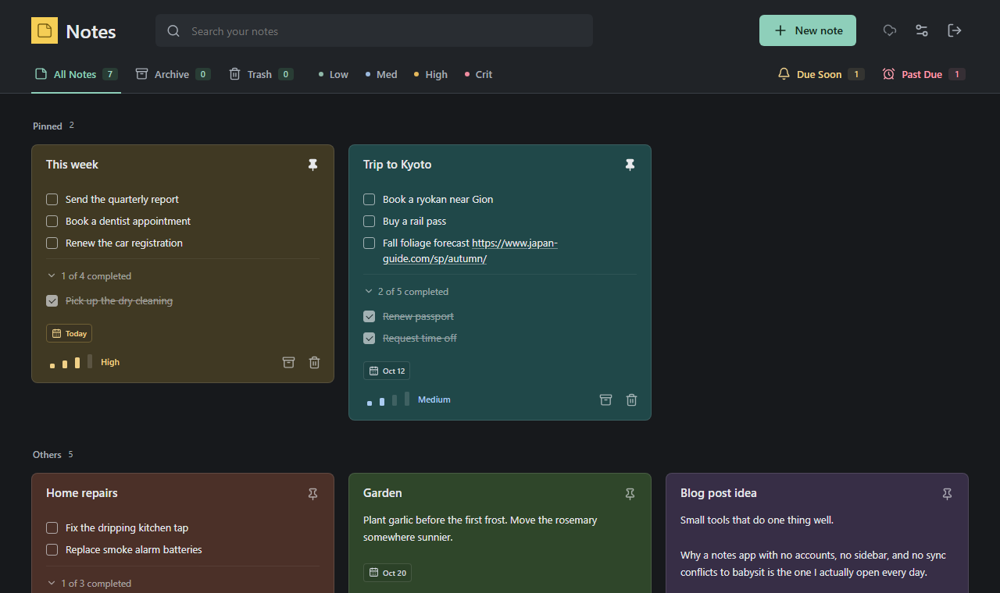
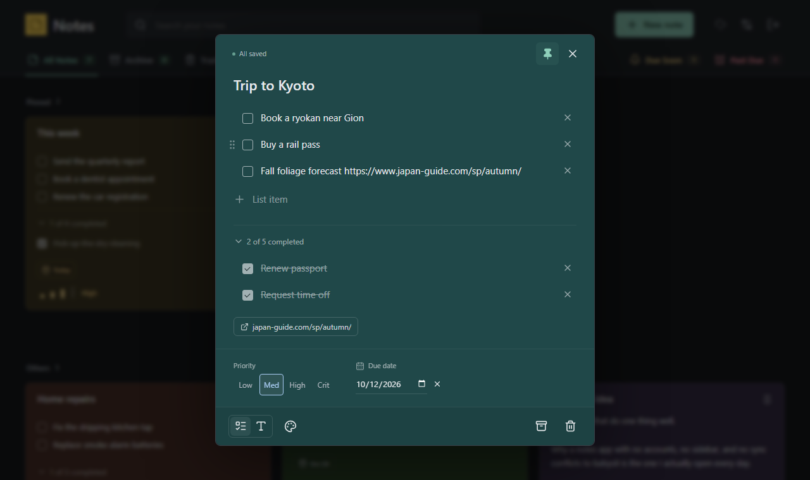
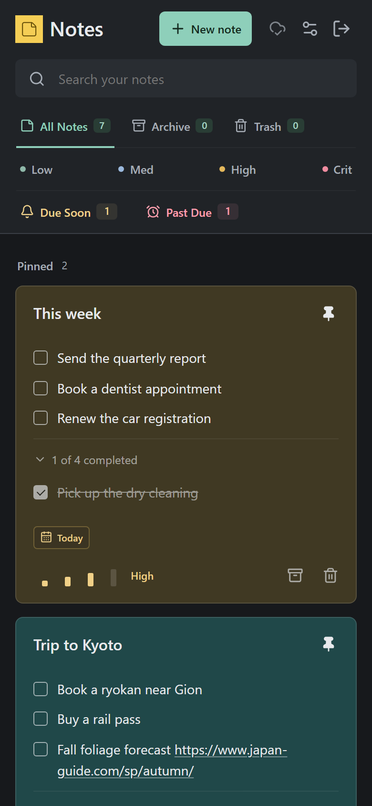
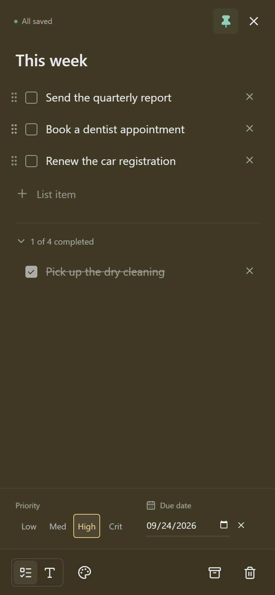
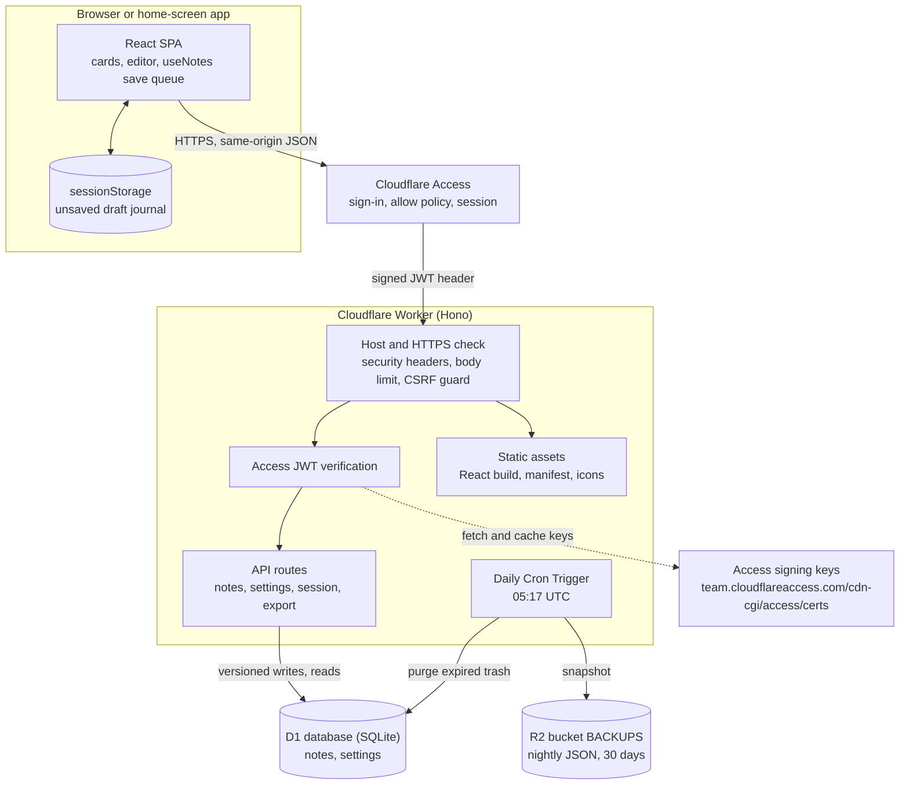

# Notes

A small, single-user notes app inspired by Google Keep. It runs on your own domain, with the application, API, database, sign-in (Cloudflare Access), nightly backups, and scheduled cleanup hosted on Cloudflare.

The goal is quick capture and low-friction daily use: open a note, type, and let it save. There are no accounts to manage, no sidebar, no collaboration features, and no light theme. The same workspace works in a desktop or mobile browser.

This is an independent application, not a Google product and not connected to Google Keep. Each installation has one workspace. Sign-in is handled by Cloudflare Access, and anyone its policy allows has full access to that workspace.



<table>
  <tr>
    <td width="52%"></td>
    <td width="24%"></td>
    <td width="24%"></td>
  </tr>
</table>

Screenshots use demo notes; regenerate them with `npm run screenshots`.

## Contents

- [Using Notes](#using-notes)
- [Architecture](#architecture)
- [Technology and design decisions](#technology-and-design-decisions)
- [Data and saving](#data-and-saving)
- [Developer guide](#developer-guide)
- [Security and privacy](#security-and-privacy)
- [Local development](#local-development)
- [Deploy on your own domain](#deploy-on-your-own-domain)
- [Operations](#operations)
- [Tests and project map](#tests-and-project-map)
- [Sharing the source](#sharing-the-source)
- [Guide for coding agents](#guide-for-coding-agents)
- [License](#license)

## Using Notes

### Sign in

Visit your installation's HTTPS address and sign in through Cloudflare Access with an email address its policy allows, using whichever login methods the installation offers (for example an emailed one-time PIN or an identity provider). The app has no login page, password, or registration of its own; once Access lets you through, the workspace opens directly.

The session lasts as long as the Access application's session duration. Use the sign-out icon in the header on a shared or public machine: it waits for pending edits to sync, then signs that browser out of Access. If the session expires while the app is open, it shows **Your Cloudflare Access session has expired.** with a **Sign in again** button; unsynced edits in that tab sync after you sign back in. Revoking your Access sessions in the Zero Trust dashboard signs out every device. See [docs/CLOUDFLARE-ACCESS.md](docs/CLOUDFLARE-ACCESS.md).

### Capture and edit

- **New note** creates a Medium-priority checklist. Add a title and as many items as needed.
- Click an item's text on its card to open that item in the editor, with the caret at the clicked text position. Titles and plain-text notes behave the same way. Autosaving does not reset the caret.
- Click directly on a checkbox to complete an item. The surrounding text opens the editor; row spacing does not toggle completion.
- In a checklist, Enter adds an item, Shift+Enter inserts a line break, and Backspace on an empty item removes it. The add and remove icons work without a keyboard.
- In the editor, drag an unchecked item by the handle to the left of its checkbox to reorder it. The handle appears on hover on desktop and is always shown on touch screens. With the handle focused, the Up and Down arrow keys move the item one place. Completed items stay in their own section and keep their order.
- Switch between checklist and plain text using the editor's type icons. Converting a checklist to text preserves its text but not its completion state; converting back creates unchecked items. Conversion that would exceed the note limits is refused.
- There is no edit mode or Save button. Changes update immediately and normally save after a short pause. Wait for **All saved** (the cloud icon beside Settings, or the status at the top of the editor) before closing the tab or browser.

To add Notes to a phone's home screen, open it in the browser and use **Add to Home Screen** (Safari's Share menu, or Chrome's menu). It opens full screen like an app.

The editor is centered on desktop and full screen on narrow mobile displays. Keyboard focus is contained in the dialog, and Escape closes it on keyboards that provide that key.

### Organize

| Control         | Behavior                                                                                                                                                                                                                                              |
| --------------- | ----------------------------------------------------------------------------------------------------------------------------------------------------------------------------------------------------------------------------------------------------- |
| Pin             | Moves a note into Pinned; unpinned active notes appear under Others.                                                                                                                                                                                  |
| Priority        | One click sets Low, Medium, High, or Critical. Cards show a four-bar signal meter filled in the level's color, with the level named beside it; the editor uses text buttons. Medium is the default; clicking the selected priority does not clear it. |
| Due date        | A date-only value, with today, tomorrow, upcoming, and overdue badges. Set it from the calendar icon on a card, change it by clicking the card's due badge, or use the editor. Clear it from the date picker or the editor's remove icon.             |
| Color           | 15 named dark solid colors plus a custom solid color. Bright custom colors are darkened to keep the interface consistently dark.                                                                                                                      |
| Completed items | Expand or collapse per note. The choice is saved in the database and follows you across devices.                                                                                                                                                      |
| Archive         | Hides a note from active views without deleting it. Open Archive in the header to restore it. A message with **Undo** appears for a few seconds after archiving, unarchiving, trashing, or restoring.                                                 |
| Trash           | Keeps a deleted note for 90 days, with restoration available before expiry. After expiry it cannot be restored through the app.                                                                                                                       |
| Settings        | Adjust the desktop note width from 240 to 440 pixels (mobile uses a single column; saved across devices), see the keyboard shortcuts, and export every note as a JSON file.                                                                           |
| Search          | Matches title, content, and checklist text within the selected view.                                                                                                                                                                                  |
| Links           | Web addresses (`http`/`https`) in note text become links on cards and open in a new tab. The editor lists a note's links below its content.                                                                                                           |
| Shortcuts       | `C` or `N` new note, `/` search (Esc clears), `1`/`2`/`3` All Notes, Archive, Trash, Esc closes a note. Ignored while typing.                                                                                                                         |

Within each section, notes are ordered by **Critical, High, Medium, Low**, then nearest due date (undated notes last), then newest creation time, with ID as a deterministic final tie-breaker. Checking items, editing text, and saving do not change this order. Changing priority, due date, or pin status can intentionally move a note. Completing work can remove a note from a due-date filter because it no longer matches that view.

### Views and silent reminders

The header contains **All Notes**, **Archive**, **Trash**, **Low / Med / High / Crit**, **Due Soon**, and **Past Due**. All Notes means active notes, not archived or trashed notes. Priority and due-date views also show active notes only. Views are alternatives, not combinable filters; search works within the current view.

Due Soon includes today through three calendar days ahead. Past Due means before today. Dates use the viewing device's local calendar, not a stored timezone or time of day, so devices in different timezones can disagree near midnight.

Amber and red header counts flag active checklists with at least one unfinished item, and dated plain-text notes. A plain-text note has no completed state, so its date remains actionable until cleared, archived, or trashed. Completed checklists, empty checklists, archive, and trash do not trigger these counts. The counts cover all active notes regardless of search or the current view and refresh after edits, at least once a minute, and when returning to the tab.

**There are no sounds, emails, push notifications, or background reminder deliveries.** The notices are part of the open web page.

## Architecture



- **Public vars:** `APP_ORIGIN`, `ENVIRONMENT`, `ACCESS_TEAM_DOMAIN`, `ACCESS_AUD`
- **Bindings:** `DB` (D1), `ASSETS` (static assets), `BACKUPS` (R2, optional)
- **Worker secrets:** none

### Cloudflare pieces

| Service or capability                     | How this app uses it                                                                                                                                                                                                                                         |
| ----------------------------------------- | ------------------------------------------------------------------------------------------------------------------------------------------------------------------------------------------------------------------------------------------------------------ |
| **Workers**                               | Runs the API, Access token verification, request guards, and scheduled cleanup. No separate server or container.                                                                                                                                             |
| **Workers Static Assets**                 | Serves the compiled frontend through the `ASSETS` binding. `run_worker_first` keeps host checks and security headers in front of assets; SPA fallback serves the app shell. This is not a Cloudflare Pages project.                                          |
| **D1**                                    | One SQLite database, bound as `DB`, stores all persistent application state. No external database, ORM service, or connection pool.                                                                                                                          |
| **Cloudflare Access (Zero Trust)**        | Required. A self-hosted Access application gates every request at the edge and handles sign-in, allowed emails, login methods, and session length. The Worker also verifies the Access token on every API request. [Setup guide](docs/CLOUDFLARE-ACCESS.md). |
| **R2**                                    | Optional. The `BACKUPS` bucket receives a JSON snapshot of the workspace every night, keeping 30 days. Without the binding, nightly backups are skipped.                                                                                                     |
| **Custom Domain, DNS, and TLS**           | Attaches your hostname directly to the Worker. Cloudflare manages the DNS record and certificate for the Custom Domain. [Cloudflare reference](https://developers.cloudflare.com/workers/configuration/routing/custom-domains/).                             |
| **Cron Triggers**                         | Runs daily at `05:17 UTC` (`17 5 * * *`) to physically purge expired trash and write the nightly backup.                                                                                                                                                     |
| **Observability**                         | Worker observability is enabled in configuration. Application errors log an error class, not note bodies or tokens. Account-level log access and retention remain the operator's responsibility.                                                             |
| **Wrangler and the official Vite plugin** | Build, local Workers runtime, D1 migrations, and deployments. They are development tools, not additional hosted services.                                                                                                                                    |

The app requires Cloudflare Access and optionally uses R2 for backups. It does **not** use KV, Durable Objects, Queues, Pages, Workers AI, Worker secrets, or Turnstile. Identity providers are optional: Access's built-in one-time PIN works without one. WAF rules can be an additional account/zone-level layer, but the repository does not provision them and does not depend on a paid WAF configuration.

## Technology and design decisions

The lockfile records the exact dependency versions. The current major-version stack is React 19, TypeScript 7, Vite 8, Hono 4, Zod 4, Vitest 5, and Playwright 1.

| Choice                                   | Reason                                                                                                                                                                                                                                                             |
| ---------------------------------------- | ------------------------------------------------------------------------------------------------------------------------------------------------------------------------------------------------------------------------------------------------------------------ |
| **TypeScript throughout**                | Browser, Worker, and shared contracts use one language. Type checks catch mismatched note fields; Zod validates untrusted data at runtime.                                                                                                                         |
| **React single-page app**                | This is an authenticated workspace, not an SEO-driven site. A SPA keeps editing state and navigation straightforward without server rendering, hydration, or a large routing framework.                                                                            |
| **Vite + official Cloudflare plugin**    | Fast development and a build that targets the actual Worker runtime. A fixed Vite environment name keeps output at `dist/worker` regardless of the installation's Worker name. [Plugin API](https://developers.cloudflare.com/workers/vite-plugin/reference/api/). |
| **Hono**                                 | A small request-routing and middleware layer suited to the Web Request/Response model.                                                                                                                                                                             |
| **Zod**                                  | One note schema shared by client-side conversions and server-side validation.                                                                                                                                                                                      |
| **D1 + bound SQL**                       | Durable cross-device storage and version-checked writes without a separate database service. The schema is small enough that an ORM adds little value.                                                                                                             |
| **Plain CSS + Lucide**                   | Responsive layout and recognizable icons without a large component system. Native dialogs, date inputs, checkboxes, and color inputs handle familiar browser behavior.                                                                                             |
| **System fonts and local assets**        | No external font requests or stock imagery. Generated bitmap icons (`scripts/generate-icon.mjs`) identify the app and its home-screen install; notes themselves are the primary content.                                                                           |
| **Permanent dark theme**                 | Consistent notes, dialogs, autofill, and native controls. Solid muted note colors provide distinction without bright surfaces or decorative gradients.                                                                                                             |
| **Plain text, not rich HTML**            | Predictable editing, a smaller security surface, and fewer formatting controls. HTML in a note is displayed as text, not executed.                                                                                                                                 |
| **Polling, not real-time collaboration** | A single owner benefits from simple cross-device refresh. Polling avoids WebSocket infrastructure and multi-user merge algorithms.                                                                                                                                 |
| **Recover both versions on conflict**    | An explicit recovered copy is safer than silently choosing one device's edits. No claim of automatic line-by-line merging.                                                                                                                                         |
| **Stable sorting**                       | Note position reflects explicit organization, not the incidental time of an autosave or number of completed tasks.                                                                                                                                                 |

## Data and saving

Each note has a UUID, title, type (`list` or `text`), content, ordered checklist items, pin state, status, color, priority, optional due date, completed-item visibility, version, and timestamps. Each item has its own UUID, text, and completion flag.

The `notes` table stores a JSON document plus indexed/queryable status, deletion timestamp, version, update timestamp, and last mutation ID. `settings` stores the single workspace's note width. There are no user, session, or credential tables; sign-in state lives in Cloudflare Access. The initial schema is in [migrations/0001_initial.sql](migrations/0001_initial.sql); [migrations/0002_remove_password_login.sql](migrations/0002_remove_password_login.sql) drops the `sessions` and `login_limits` tables left over from the app's former password login.

### Save lifecycle

1. An edit updates the UI immediately and journals the unsaved state in the current tab's `sessionStorage`.
2. A per-note queue waits about 500 ms after the latest edit, then sends the complete note with its version and a unique mutation ID.
3. The Worker validates the document and conditionally writes it only if the saved version still matches. The server owns creation/update/deletion timestamps.
4. Acknowledged saves advance the version and clear that saved draft. Further typing during a request stays queued for another write.
5. A lost response is retried with the same mutation ID, allowing the server to recognize the already-applied write. Transient failures retry after about five seconds.
6. Conflicting edits or expired-trash conflicts preserve local work in an active `(recovered)` note and show a notice. Invalid or oversized writes remain marked as needing attention until corrected.

Visible tabs fetch remote changes every 20 seconds, and on window focus or coming online. Pending local notes are not overwritten by polling. This is eventual refresh, not live collaborative editing; settings use last successful write rather than note-style conflict copies.

The app warns before leaving with unsaved notes where the browser allows it. Sign out waits for pending saves and stays signed in if they cannot finish. A draft journal helps with refreshes and interrupted connections, but **does not guarantee recovery after a tab is closed, storage is cleared, or the browser discards it**. This is not a fully offline app: the home-screen install is a web app manifest only, with no service worker or offline note cache.

### Limits

- Title: 300 characters; plain-text content: 100,000 characters.
- Checklist: up to 1,000 items, each up to 5,000 characters.
- API request body: 1 MiB; this overall limit can be reached before individual field limits.
- The current API loads all non-expired notes, including archive and unexpired trash, into the signed-in browser. Search and view filtering happen there. There is no pagination or large-collection optimization.
- No attachments, public links, in-app import (restores use `npm run restore`; see [Operations](#operations)), rich text, nested tasks, recurring tasks, multiple workspaces, or user roles. Passkeys and multi-factor authentication are not built into the app but are available through the identity providers you connect to Cloudflare Access.

## Developer guide

This section is for people changing the code. The [project map](#tests-and-project-map) lists where each part lives.

### Request pipeline

Every request passes through the middleware in `worker/index.ts`, in this order:

1. **Host and scheme.** Outside local development, the request origin must equal `APP_ORIGIN`. Plain-HTTP `GET`/`HEAD` to the right host gets a `308` to HTTPS; anything else gets `403`. After the handler runs, this middleware adds the security headers (CSP, HSTS in production, `no-store`, `nosniff`, frame, referrer, and permissions policies).
2. **Body limit** (`/api/*`). Bodies over 1 MiB get `413`.
3. **CSRF guard** (`/api/*`, anything but `GET`/`HEAD`). Requires the exact `Origin`, `X-Keep-Request: 1`, and a JSON `Content-Type`. The custom header forces a CORS preflight that a cross-site page cannot pass.
4. **Access** (`/api/*`). `503` if `ACCESS_TEAM_DOMAIN` or `ACCESS_AUD` is missing or malformed, `401` if the `Cf-Access-Jwt-Assertion` token does not verify. The verified email is stored on the Hono context.
5. **Routes.** `/api/session` and `/api/export`, then the notes router (`worker/notes.ts`). Unknown `/api/*` paths get a JSON `404`.
6. **Assets.** Every other `GET` goes to the `ASSETS` binding, with SPA fallback to `index.html`. `run_worker_first` in the Wrangler config sends static files through step 1 too, so they get the same host check and headers.

`app.onError` turns malformed JSON (`SyntaxError`) into `400` and any other exception into a generic `503`. Only the error class is logged, never note contents.

### API

All routes are same-origin and behind Access. Mutations need the CSRF headers above.

| Route                | Request                       | Responses                                                                                                                                                                             |
| -------------------- | ----------------------------- | ------------------------------------------------------------------------------------------------------------------------------------------------------------------------------------- |
| `GET /api/session`   |                               | `{ email, local }`. `email` comes from the Access token (`null` in local development).                                                                                                |
| `GET /api/notes`     |                               | `{ notes, noteWidth }`: every note except trash older than 90 days.                                                                                                                   |
| `PUT /api/notes/:id` | `{ note, mutationId }` (UUID) | `200 { note }` with the saved note; `409 { error, current }` on a version conflict; `410` for expired trash; `400` for an invalid note or mismatched ID; `413` for an oversized body. |
| `PUT /api/settings`  | `{ noteWidth }` (240–440)     | `200 { noteWidth }` or `400`.                                                                                                                                                         |
| `GET /api/export`    |                               | The [export document](#scheduled-jobs-and-the-export-format) as an attachment named `notes-export-YYYY-MM-DD.json`.                                                                   |

There is no create or delete route. A note is created by its first `PUT` with `version: 0`; archive, trash, restore, and completion are ordinary updates to `status` or `items`. Physical deletion only happens in the scheduled cleanup.

### Data model

`shared/notes.ts` holds the Zod `noteSchema`, which both the browser and the Worker import. The `notes` table stores each note as a JSON `document` (the source of truth) plus the columns the database needs to query or guard on:

| Column          | Purpose                                                                       |
| --------------- | ----------------------------------------------------------------------------- |
| `id`            | Note UUID, generated by the client.                                           |
| `document`      | The full note as JSON, exactly as returned to clients.                        |
| `version`       | Optimistic-concurrency counter, incremented on every accepted write.          |
| `status`        | `active`, `archived`, or `trashed`; indexed together with `deleted_at`.       |
| `deleted_at`    | When the note entered the trash; drives the 90-day expiry.                    |
| `updated_at`    | Server time of the last write.                                                |
| `last_mutation` | The `mutationId` of the last accepted write, used to make retries idempotent. |

`settings` is a single row (`id = 1`) holding `note_width`. Schema changes go in a new numbered file in `migrations/`; never edit an applied migration.

### Save and sync protocol

The client (`src/useNotes.ts`) keeps a `pending` map of notes with unsent changes. Each entry holds the `desired` note, a `generation` counter bumped on every edit, and the `flight` (the copy and `mutationId` currently being sent). The map is mirrored to `sessionStorage` so a refresh does not lose it.

1. An edit replaces `desired`, bumps `generation`, and schedules a send 500 ms later (debounced per note). At most one request per note is in flight.
2. The server loads the stored row. If `last_mutation` equals the request's `mutationId`, the write already happened, so it returns the stored note. This makes retries after a lost response safe.
3. Otherwise the request's `version` must equal the stored version (or be `0` for a new note). The write is a conditional `UPDATE ... WHERE id = ? AND version = ?` (or `INSERT ... ON CONFLICT DO NOTHING`), so two concurrent writers cannot both succeed. The server sets `version + 1`, `createdAt`, `updatedAt`, and `deletedAt`.
4. On `200`, if no edit happened during the flight, the entry is removed. Otherwise the newer `desired` is rebased onto the returned version and sent again.
5. On `409` or `410`, the local edits are saved as a new `(recovered)` note and the server's current copy is kept, so neither side's work is lost. `401` shows the Access expiry screen, `400` and `413` mark the note as needing attention, and anything else retries after 5 seconds.

Polling (`GET /api/notes` every 20 seconds while the tab is visible, plus on focus and when coming online) never overwrites notes in `pending`. An `editGeneration` counter discards a poll response if any edit or acknowledgment happened while it was in flight, and an `epoch` counter discards responses that arrive after the workspace unmounted.

### Cloudflare Access verification

`worker/security.ts` verifies the Access token with Hono's JWT utilities. It fetches the team's signing keys from `https://<ACCESS_TEAM_DOMAIN>/cdn-cgi/access/certs` and caches them per Worker isolate for up to an hour. A token signed with an unknown key ID triggers an early refetch, at most once a minute, so key rotation works without letting bad tokens force a fetch on every request. It then checks the RS256 signature, `iss` (the team domain), `aud` (`ACCESS_AUD`), and that `exp` is present and in the future. If the keys cannot be fetched, the request fails with `503` rather than being let through.

`isLocal()` is the only bypass: `ENVIRONMENT=development` **and** a loopback hostname. `check:deploy` refuses a production config with any other `ENVIRONMENT`.

### Frontend structure

There is no router or state library. `src/App.tsx` loads `/api/session`, then renders either the Access expiry screen or `Workspace`, which owns the view filter, search, the open editor, settings, the undo message, and keyboard shortcuts. All note state lives in the `useNotes` hook; components receive a note and an `onChange` callback and never call the API directly. Every change goes through `Workspace`'s `change()`, which is also where status changes are noticed so the undo message can reverse them.

`src/api.ts` sends requests with `redirect: "manual"`. When the Access session has expired, Access answers an API call with a redirect to its login page; the resulting `opaqueredirect` response is reported as a `401`, so the app shows **Sign in again** instead of failing on a cross-origin redirect.

Styling is one plain CSS file with no framework. Icons come from `lucide-react`, and native elements (`<dialog>`, date and color inputs, checkboxes) are used where possible.

### Scheduled jobs and the export format

The daily Cron Trigger runs `cleanup()` (deletes notes whose trash period has ended) and `backup()` (in `worker/backup.ts`) in parallel. `backup()` writes `backups/notes-YYYY-MM-DD.json` to the `BACKUPS` R2 bucket and deletes keys older than 30 days; it does nothing if the binding is absent. The nightly backup and `GET /api/export` produce the same document:

```json
{
  "format": "notes-app-export",
  "version": 1,
  "exportedAt": "2026-09-25T05:17:00.000Z",
  "noteWidth": 300,
  "notes": [{ "id": "…", "title": "…", "kind": "list", "items": [] }]
}
```

Each entry in `notes` is a complete note as defined by `noteSchema`. `scripts/restore-backup.mjs` (`npm run restore`) turns the document into SQL upserts for `wrangler d1 execute`, giving each restored note a fresh `last_mutation`. Bump `version` in the format if its shape changes, and keep the restore script able to read older versions.

### Extending the app

- **A new note field.** Add it to `noteSchema` and `makeNote()` in `shared/notes.ts`. Existing documents in D1 do not have it, and clients send back what they loaded, so make the field optional or give it a Zod `.default()`; otherwise every older note fails validation on its next save. Handle the missing value in the UI, and in `convertNote()` if relevant.
- **A new API route.** Register it after the Access middleware in `worker/index.ts` (or in `worker/notes.ts`), validate input with Zod, and use bound SQL parameters. Mutating routes get the CSRF guard automatically.
- **A schema change.** Add `migrations/000N_description.sql`, apply it locally with `npm run db:local`, and note the `npm run db:remote` step for deployments. The Vitest runtime tests apply every migration in order.
- **Tests.** Worker behavior is tested against the built Worker in Miniflare (`tests/security.test.ts`, `tests/backup.test.ts`), which is why `npm test` builds first. Browser flows use Playwright against the Vite dev server in local mode. Mirror an existing test when adding one.

## Security and privacy

Security is layered, but this is not an independently audited or end-to-end encrypted vault.

**Transport and origins.** Production accepts only the configured HTTPS origin. HTTP GET/HEAD requests to that host redirect to HTTPS; plaintext writes and alternate hosts are rejected. `workers.dev` and preview URLs are disabled. The Worker emits HSTS, no-store, nosniff, frame restrictions, a referrer policy, permissions policy, and CSP. Scripts are restricted to this origin, frames are disallowed (`frame-src 'none'`), and inline styles are permitted for note colors and UI styling.

**Cloudflare Access.** The app has no password, login page, or session of its own. A Cloudflare Access self-hosted application in front of the hostname decides who can sign in (its policy), how (its login methods, including any MFA or passkeys your identity provider offers), and for how long (its session duration). Access is required: in addition to the edge gate, the Worker verifies the `Cf-Access-Jwt-Assertion` token on every `/api/*` request, checking its RS256 signature against the team's public keys, the issuer (`ACCESS_TEAM_DOMAIN`), the audience (`ACCESS_AUD`, the application's AUD tag), and expiry. It fails closed: a missing or invalid token gets `401`, and missing or malformed Access configuration or unavailable signing keys get `503`. This keeps the API closed even if the Access application is deleted or misconfigured. Sign out goes to the Access logout URL; revoking a user's Access sessions in Zero Trust signs out every device. Loopback development with `ENVIRONMENT=development` is the only mode that skips Access. See [docs/CLOUDFLARE-ACCESS.md](docs/CLOUDFLARE-ACCESS.md) for setup and details.

**API boundaries.** Mutations require the exact Origin, JSON content type, and `X-Keep-Request: 1` header, in addition to the Access token. SQL values are bound parameters. Zod enforces note shape, date validity, field sizes, and safe hex colors. Notes are not rendered as HTML. The `keep` names in the request header and draft-journal key are internal compatibility identifiers, not an owner identity or external dependency.

**Data exposure.** Cloudflare and authorized account administrators can read the database contents and change the Access policy. TLS protects transport; it does not provide end-to-end encryption. Unsaved drafts in `sessionStorage` are not encrypted. The Worker stores no credentials; the signed-in email is read from the Access token per request and not saved. No application analytics, advertising, external fonts, or third-party error tracker is included. Cloudflare Access, your identity provider, and Cloudflare infrastructure still process sign-in and network/security data under their own policies.

Do not treat a public machine as trusted merely because sign out exists. Wait for pending work to sync, sign out, and close the browser session. For a lost device, revoke your Access sessions in the Zero Trust dashboard from a trusted device, and secure the Cloudflare account with its available account protections, since whoever controls it controls the Access policy.

## Local development

Use Node.js 22.12 or newer (Node 24 is a suitable baseline), npm, and a current browser. Cloudflare authentication is not required to edit and test against local D1.

```sh
npm ci
npm run setup:local
npm run db:local
npm run dev
```

Open `http://127.0.0.1:5173`. The workspace opens without any sign-in. `setup:local` copies `.dev.vars.example` (only `ENVIRONMENT` and `APP_ORIGIN`) to ignored `.dev.vars` without replacing an existing file. The local Worker uses emulated D1 under `.wrangler/state`; it is separate from production.

Development's HTTP and Cloudflare Access exemption applies only when `ENVIRONMENT=development` **and** the request hostname is loopback (`localhost`, `127.0.0.1`, or `[::1]`). Do not expose the dev server to the public Internet. `npm run check:deploy` refuses to deploy a config whose `ENVIRONMENT` is not `production`.

If port 5173 is occupied, use `npm run dev -- --port 5175` and open the URL Vite prints. Browser tests reserve 5174. Run one local Cloudflare/Vite server at a time if your environment has debugger/runtime port conflicts.

## Deploy on your own domain

This section is sufficient for a fresh installation. [The operations runbook](docs/DEPLOYMENT.md) covers updates, recovery, and troubleshooting. Use your own account, domain, database, and Access application; never reuse someone else's IDs.

### 1. Prepare the account and private config

You need a Cloudflare account with an active DNS zone for your domain, permission to deploy Workers and D1, Zero Trust enabled with permission to manage Access, and control of the intended hostname. Choose a hostname such as `notes.example.com`, replacing every example with your real domain.

```sh
npm ci
npm run setup:local
npm run setup:deploy
npx wrangler login
npx wrangler whoami
```

`wrangler.jsonc` is a **public, intentionally non-deployable template**. `setup:deploy` creates `wrangler.production.jsonc`, which is ignored by Git and never overwrites an existing copy. Keep all installation-specific names, IDs, and hostnames in that private file. Its location in the project root keeps relative source and migration paths valid.

Set its Worker `name` to a name unique within your account. If you belong to multiple accounts, set `account_id` in this private config to make the target explicit. The app needs no Worker secrets; every value it reads is a public `var`.

### 2. Create and bind D1

```sh
npx wrangler d1 create notes-app --config wrangler.production.jsonc
```

Use your chosen database name if different. In the private config's `d1_databases` entry, keep `binding: "DB"` and `migrations_dir: "migrations"`, and set the returned `database_name` and `database_id`. Then initialize the remote schema:

```sh
npm run db:remote
```

For nightly backups, also create an R2 bucket and name it in the private config's `r2_buckets` entry (binding `BACKUPS`). To go without backups, delete that entry instead.

```sh
npx wrangler r2 bucket create notes-app-backups
```

Do not rerun database creation when updating an existing installation. Migrations are tracked and applied once. [D1 Wrangler commands](https://developers.cloudflare.com/d1/wrangler-commands/).

### 3. Configure the domain

Set these values in `wrangler.production.jsonc`:

| Field                         | Value                                                                                                |
| ----------------------------- | ---------------------------------------------------------------------------------------------------- |
| `routes`                      | Exactly one entry: `{ "pattern": "notes.example.com", "custom_domain": true }`, using your hostname. |
| `vars.APP_ORIGIN`             | The exact `https://` origin for that host, with no path or trailing slash.                           |
| `vars.ENVIRONMENT`            | `production`                                                                                         |
| `workers_dev`, `preview_urls` | Keep both `false`.                                                                                   |

Cloudflare provisions DNS and the TLS certificate when attaching the Custom Domain. Resolve conflicting DNS records carefully before attachment; do not delete records used by another service. This deployment does not change zone-wide TLS or WAF settings. Review those separately because they can affect other applications on the domain.

### 4. Create the Cloudflare Access application

Follow [docs/CLOUDFLARE-ACCESS.md](docs/CLOUDFLARE-ACCESS.md) to add login methods, create an Allow policy listing the emails that may sign in, and create a self-hosted Access application covering your whole hostname. Then copy two values from Zero Trust into the private config's `vars`:

| Field                     | Value                                                                                             |
| ------------------------- | ------------------------------------------------------------------------------------------------- |
| `vars.ACCESS_TEAM_DOMAIN` | Your Zero Trust team domain, such as `<team>.cloudflareaccess.com`, without `https://` or a path. |
| `vars.ACCESS_AUD`         | The Access application's **Application Audience (AUD) Tag**, 64 hex characters.                   |

Neither value is a secret, and the app has no Worker secrets to install. Access is required: until both values are set and match the application protecting the hostname, the API answers `503` or `401` and the app does not load notes.

### 5. Verify and deploy

```sh
npm run db:local
npm test
npx playwright install chromium
npm run test:e2e
npm run check:deploy
npm run deploy -- --dry-run
npm run deploy
```

`deploy` validates the private config, builds it through Vite, and deploys the generated `dist/worker/wrangler.json` with its frontend assets. The dry run builds and validates without publishing. On a brand-new installation the first deploy creates the Worker; confirm the account and Worker name first. Validation rejects placeholder domains/IDs, a missing or malformed Access team domain or AUD tag, mismatched hosts, enabled alternate URLs, and non-production mode. It does not prove account ownership, resource existence, that the Access values belong to the application protecting your hostname, or certificate readiness; the live checks still matter.

Normal `npm run build`, `npm test`, and `npm run dev` use the public generic config. The deployment wrapper alone sets `NOTES_CONFIG` for its production build. Do not leave that variable set in a general development shell, and do not deploy a stale build directly with bare `wrangler deploy`.

### 6. Check the live installation

1. Confirm anonymous requests to `/` and `/api/notes` both return `302` to `https://<team>.cloudflareaccess.com/cdn-cgi/access/login/...` (the `curl` commands are in [docs/CLOUDFLARE-ACCESS.md](docs/CLOUDFLARE-ACCESS.md#5-verify)). Wait for DNS/certificate provisioning if the certificate is not yet valid.
2. In a private window, sign in through Access with an allowed email. The notes workspace should load directly, and the sign-out button's label should show that email. If the app says **Sign in through Cloudflare Access** or **Cloudflare Access is not configured**, compare `ACCESS_TEAM_DOMAIN` and `ACCESS_AUD` with the Access application.
3. Create a note, wait for All saved, reload, and confirm it persists. Check a second device after its next refresh.
4. Sign out and confirm the next visit asks for the Access login again.
5. Check the Worker dashboard for its D1 and R2 bindings, Custom Domain, and daily Cron Trigger. The day after deploying, confirm `backups/notes-YYYY-MM-DD.json` appeared in the R2 bucket.

The scripts configure the application and deploy resources declared in Wrangler. They do not register a domain, activate a zone, create the Access application automatically, or provision CI credentials.

## Operations

**Updates.** Preserve the ignored production config and all existing resource IDs. Apply new migrations with `npm run db:remote` when a release adds them; back up first for schema changes. Run the tests, then `npm run deploy`. An installation upgrading from the former password login must set up Cloudflare Access and its two `vars` before deploying, then run `npm run db:remote` (migration `0002` drops the old `sessions` and `login_limits` tables). Afterwards it may delete the now-unused `APP_PASSWORD`, `SESSION_SECRET`, and `TURNSTILE_SECRET_KEY` Worker secrets and the Turnstile widget.

**Access changes.** Who can sign in, login methods, and session length are edited in the Zero Trust dashboard and take effect without a redeploy. Revoke a user's Access sessions to sign out all of their devices. Only a new team domain or a replacement Access application (new AUD tag) requires updating the private config and redeploying.

**Backups and recovery.** Keep SQL exports under ignored `.private/` or another restricted storage location. They contain private notes. D1 also offers Time Travel recovery, subject to its current service limits. Restore into a separate database and inspect it before replacing production whenever possible. [D1 recovery reference](https://developers.cloudflare.com/d1/reference/time-travel/).

```sh
npx wrangler d1 export DB --remote --config wrangler.production.jsonc --output .private/notes-backup.sql
```

Create `.private/` first if it does not exist.

**Export and nightly backups.** Settings → **Export notes** downloads every note (including archive and unexpired trash) and the note width as one JSON file. The daily Cron Trigger also writes that same JSON to the R2 bucket bound as `BACKUPS`, at `backups/notes-YYYY-MM-DD.json`, and deletes copies older than 30 days. Create the bucket before deploying (`npx wrangler r2 bucket create <bucket-name>`) and set its name in the private config's `r2_buckets`; remove the binding to turn nightly backups off. See [Database Backup and Recovery](docs/DEPLOYMENT.md#database-backup-and-recovery) to restore one. Application trash expiry is not a guarantee of erasure from exports, recovery snapshots, or provider backups.

**Retention.** Expired trash is hidden and rejected immediately at 90 days, even before the cron runs. The daily cleanup physically deletes it.

**Costs.** The running services are Workers requests/CPU, static assets, D1 reads/writes/storage, R2 storage and operations for backups, Cloudflare Access (Zero Trust), DNS/TLS, and configured logs. The app is designed for personal use but does not promise zero cost or a particular plan's limits. Polling reads the whole collection and verifies the Access token each time; growth increases database work. Consult the current Cloudflare account usage, quotas, and billing before choosing a plan. No paid external application service is required by the code.

See [docs/DEPLOYMENT.md](docs/DEPLOYMENT.md) for the troubleshooting table, domain changes, backup/restore cautions, and deployment commands.

## Tests and project map

```sh
npm run check          # TypeScript only
npm test              # TypeScript + production build + Vitest
npm run test:e2e       # Playwright + isolated local Worker/D1
npm audit             # Dependency advisory check
npm run screenshots   # Regenerate README screenshots in docs/screenshots
```

Vitest covers note rules, sorting, validation, link detection, security boundaries (including Access token verification), and export, nightly backup, and restore in a real local Worker/D1/R2 runtime, plus portable deployment configuration. Playwright covers API behavior, autosave, lost responses, concurrent edits, Access sign-out and session expiry, note lifecycle, undo, filters, colors, desktop/mobile layouts, caret transfer, exact checkbox targeting, one-click priority, drag reordering, card due dates, links, export download, keyboard shortcuts, and the web app manifest.

Browser tests use port 5174 and a fresh D1 directory under `.wrangler/e2e-*` for each run. They run in local development mode, which skips Cloudflare Access, and stub the Access logout and expiry redirects. Keep `.dev.vars` aligned with `.dev.vars.example` for the browser suite. Install Chromium before the first run. Screenshots and retained failure traces are in ignored `test-results/`. Mobile browser emulation is useful but does not replace a real iPhone/Android smoke test, especially for soft keyboards, autofill, and native date controls. No automated test signs in through a real Access application; that is part of the live check.

| Path                                     | Responsibility                                                                                                 |
| ---------------------------------------- | -------------------------------------------------------------------------------------------------------------- |
| `src/App.tsx`                            | Workspace, header, filters, due counts, settings, sign out, Access expiry screen.                              |
| `src/components/`                        | Note cards, editor (with drag reordering), priority picker, link detection, dialogs, and icon controls.        |
| `src/editorFocus.ts`                     | Browser hit-testing to carry a clicked caret into an editor field.                                             |
| `src/useNotes.ts`                        | Save queue, tab draft journal, retries, polling, and conflict recovery.                                        |
| `src/api.ts`                             | Same-origin requests, timeouts, Access redirect detection, and API error handling.                             |
| `src/styles.css`, `public/`              | Dark responsive styling, icons, and the web app manifest.                                                      |
| `shared/notes.ts`                        | Note schema, defaults, colors, date rules, sorting, and format conversion.                                     |
| `worker/index.ts`                        | Request guards, security headers, routing, assets, and scheduled entry point.                                  |
| `worker/security.ts`                     | Local-mode detection, Access configuration check, and Access token verification.                               |
| `worker/notes.ts`                        | Versioned note writes, preferences, expiry, and cleanup.                                                       |
| `worker/backup.ts`                       | Export snapshot and nightly R2 backup with 30-day pruning.                                                     |
| `migrations/`                            | D1 schema history. Add migrations rather than modifying applied ones.                                          |
| `scripts/`                               | Local/production setup, deploy checks, build/deploy wrapper, test server, icon generation, and backup restore. |
| `tests/`                                 | Unit, runtime/security, deployment, API, browser, and resilience coverage.                                     |
| `wrangler.jsonc`, `.dev.vars.example`    | Generic templates safe for source control.                                                                     |
| `wrangler.production.jsonc`, `.dev.vars` | Ignored installation-specific configuration.                                                                   |
| `docs/`                                  | Operations runbook, Cloudflare Access guide, and historical high-level design notes.                           |

See [API](#api) for the routes and responses.

## Sharing the source

Public templates, tests, examples, and documentation use generic names. A fork should not require changing application source to use a different domain. Real hostnames, account IDs, database IDs, Access team domains, and AUD tags belong in the ignored production config. The app has no secrets of its own; Cloudflare API tokens and account credentials stay in Cloudflare and the operator's password manager.

`.gitignore` excludes `.private/`, `.dev.vars`, private production config, `.env*` except examples, `.wrangler/`, generated builds, browser artifacts, local agent memory, logs, and backup filenames. The example local configuration and obvious test fixtures are intentionally public and must never be promoted to production.

Before publishing, inspect `git status --short`, `git diff --cached`, `git ls-files`, and any existing commit history. Ignore rules do not remove previously tracked files or secrets from history. Scan the complete publication artifact, including screenshots and exported archives; do not share a raw copy of your working directory. Rotate any credential that has been exposed instead of relying only on deletion. No publishing or Git initialization is performed by the setup scripts.

Keep owner-specific support contacts and deployment records out of shared source unless intentionally published.

## Guide for coding agents

Read this README, [docs/DEPLOYMENT.md](docs/DEPLOYMENT.md), [docs/CLOUDFLARE-ACCESS.md](docs/CLOUDFLARE-ACCESS.md), `package.json`, `wrangler.jsonc`, `shared/notes.ts`, and the relevant implementation/tests before making changes. The source is the authority for exact behavior; historical planning documents are not proof of a currently working deployment.

For a new owner, obtain their intended domain and authorized Cloudflare account, use `setup:deploy`, provision a fresh D1, have the owner create (or authorize you to create) a Cloudflare Access application and policy for their hostname, put its team domain and AUD tag in the ignored production file, run migrations and verification, then deploy. Do not infer that another installation's resources or Access application are reusable. Keep credentials out of chat, logs, public config, and `VITE_*` variables.

For an existing owner, preserve the private config, Worker identity, D1 ID, Access application, and live notes. Do not recreate the database, loosen the Access policy, alter zone-wide DNS/security policies, or publish source unless requested. A new domain requires a coordinated Custom Domain, `APP_ORIGIN`, and Access application hostname update; each browser signs in through Access again at the new hostname.

Keep changes focused. Retain schema validation, optimistic version checks, idempotency, Access token verification, backup compatibility, and truthful save states. Do not fix tests by disabling production protection or widening the local-development exemption. Verify narrow mobile layouts and interaction behavior as well as TypeScript and unit tests. Report separately what was built, tested locally, deployed, and actually verified live.

## License

Copyright 2026 Josh Simerman. Licensed under the [GNU Affero General Public License v3.0](LICENSE) (AGPL-3.0-only).

You may use, modify, and share this software, including commercially. If you distribute it, or run a modified version that other people use over a network, you must make your complete source code available to them under the same license (section 13 of the license). Running your own unmodified copy for yourself carries no extra obligations.
